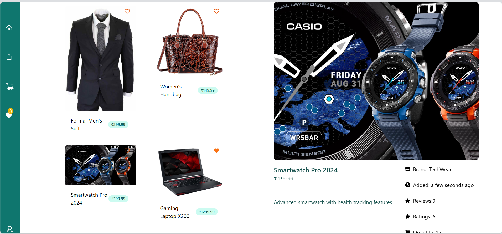
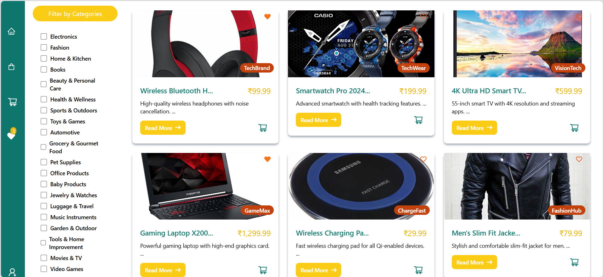
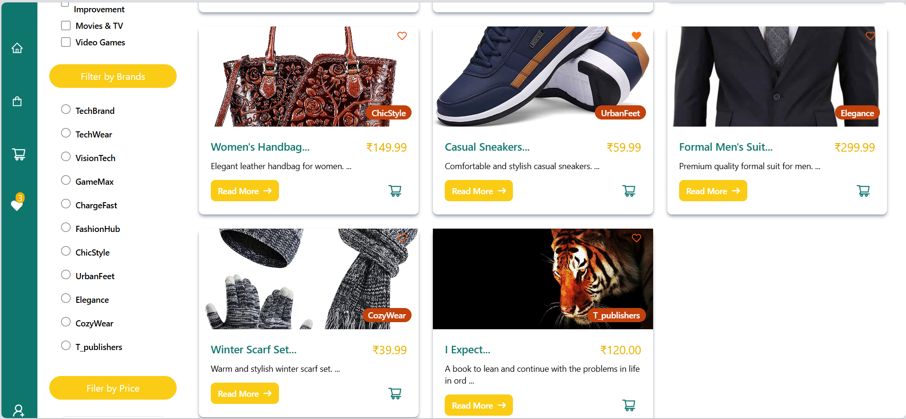
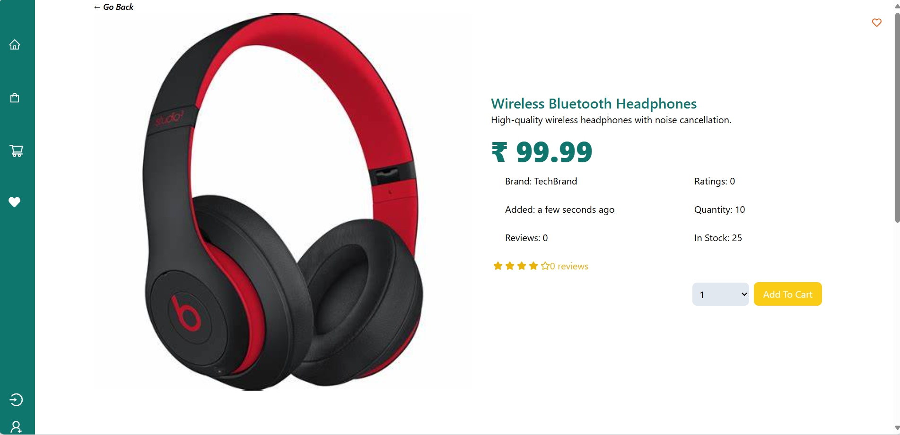

<h3>🛒 E-Buy</h3>
This project is a full-stack e-commerce application built using the MERN (MongoDB, Express.js, React, Node.js) stack. It provides a seamless shopping experience, featuring:

🔒 User authentication and authorization

🛍️ Product browsing with detailed views

🛒 Cart management

💳 Secure payment processing

📦 Order management (for users and admins)

🛠️ Admin dashboard for product and user management

 
<b>🚀 Tech Stack</b> 
Frontend: React, Redux, Tailwind CSS 
Backend: Node.js, Express.js 
Database: MongoDB (Mongoose) 
Authentication: JWT (JSON Web Tokens) 
Payments: Stripe API
 
 

<b>🖼️ Screenshots</b>
1. Home page
	
2. Store page

2. Product Page

3. Cart Page

4. Order Checkout

 
